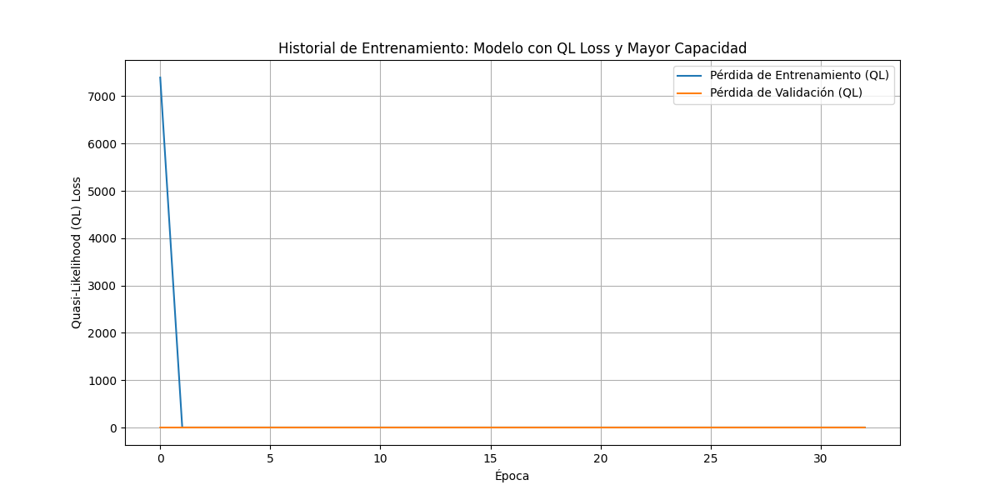
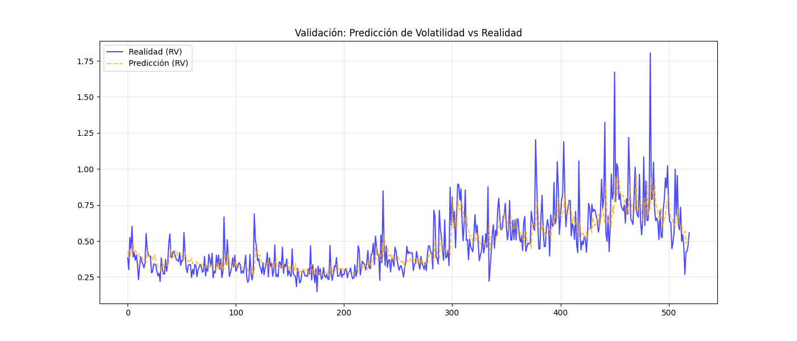
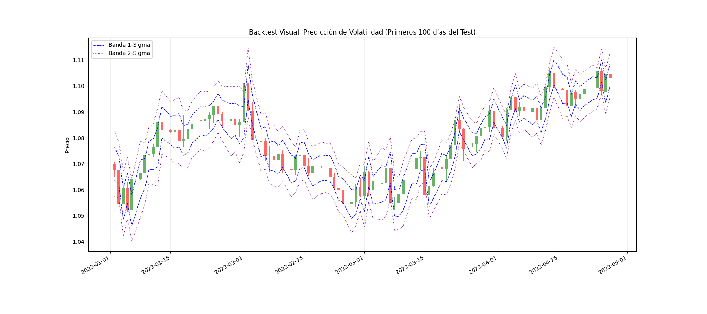

# Market Data Volatility Forecasting with Bidirectional LSTM

This project implements a Deep Learning model to forecast daily realized volatility of the EUR/USD currency pair using high-frequency (15-minute) intraday data. The core of the solution is a **Stacked Bidirectional LSTM** network, designed to capture long-term dependencies and non-linear patterns in financial time series.

## Project Overview

Volatility forecasting is crucial for risk management, option pricing, and trading strategies. Traditional models like GARCH (Generalized Autoregressive Conditional Heteroskedasticity) are widely used but have limitations:
- They often assume a specific error distribution (e.g., Normal).
- They primarily model linear relationships.
- They may struggle to capture complex, long-term dependencies in data.

**Why LSTM?**
Long Short-Term Memory (LSTM) networks are a type of Recurrent Neural Network (RNN) specifically designed to avoid the vanishing gradient problem.
- **Long Memory:** LSTMs can learn dependencies over long sequences, making them ideal for time series where past events significantly influence future volatility.
- **Non-Linearity:** Neural networks are universal function approximators, allowing them to model complex, non-linear market dynamics.
- **Bidirectional Context:** By processing the sequence both forwards and backwards, the model can extract richer feature representations from the input window.

## Dataset

- **Source:** Dukascopy
- **Instrument:** EUR/USD
- **Timeframe:** 15-minute candles (M15)
- **Period:** 2007-01-01 to 2025-01-01

## Methodology

### 1. Data Preprocessing (`preprocessing/data_preprocessing.py`)

The raw M15 data is processed to create sequences of intraday observations for each day:

1.  **Target Variable (Y):** Daily Realized Volatility (RV).
    -   Calculated as the square root of the sum of squared intraday log-returns.
    -   $RV_t = \sqrt{\sum_{i} r_{t,i}^2} \times 100$
2.  **Feature Engineering (X):** A rich set of technical indicators is computed over multiple time horizons (Short, Medium, Long) to capture different market cycles.
    -   **Volatility:** ATR, Rolling Standard Deviation, Garman-Klass Volatility.
    -   **Momentum:** RSI, CCI, ADX, ROC.
    -   **Trend:** MACD, Moving Averages slopes.
    -   **Volume:** Log Volume, OBV slope.
3.  **Dimensionality Reduction (PCA):**
    -   Indicators are grouped into families (Volatility, Momentum, Volume, Trend, Oscillator).
    -   **PCA (Principal Component Analysis)** is applied to each family to extract the most significant signal (1st Principal Component) and reduce noise/multicollinearity.
4.  **Sequence Creation:**
    -   The data is reshaped into 3D tensors `(Samples, TimeSteps, Features)` for the LSTM.
    -   Each sample represents **one day** of trading, consisting of a sequence of intraday M15 candles.
    -   Sequence Length: 96 steps (representing the last 96 15-minute intervals of the day).

### 2. Model Architecture (`model/train.py`)

The model is a Stacked Bidirectional LSTM:

-   **Input Layer:** Shape `(96, N_Features)`
-   **Layer 1:** Bidirectional LSTM (128 units) + Dropout (0.3)
-   **Layer 2:** LSTM (64 units) + Dropout (0.3)
-   **Dense Layer:** 32 units (ReLU activation)
-   **Output Layer:** 1 unit (ReLU activation) - Predicts Realized Volatility.

**Loss Function: Quasi-Likelihood (QL)**
Instead of standard MSE, we use the QL loss function, which is robust for volatility estimation (as suggested by Brownlees & Engle).
$$ L(y, \hat{y}) = \frac{y}{\hat{y}} - \log\left(\frac{y}{\hat{y}}\right) - 1 $$

### 3. Training and Evaluation

-   **Optimizer:** Adam (Learning Rate: 0.0005)
-   **Callbacks:** Early Stopping and Model Checkpoint to prevent overfitting.
-   **Metrics:** MAE, MSE, RMSE.

## Results

The model was evaluated on an out-of-sample test set (2023-2025).

### Training History
The loss curves show stable convergence without significant overfitting.



### Prediction vs Reality (Validation)
The model effectively tracks the volatility clusters, capturing both periods of calm and high turbulence.



### Visual Backtest (Test Set)
The predicted volatility is used to construct dynamic confidence bands (1-Sigma and 2-Sigma) around the daily opening price.
-   **Blue Dashed Line:** 1-Sigma Band ($Open \pm \sigma_{pred}$)
-   **Purple Dotted Line:** 2-Sigma Band ($Open \pm 2\sigma_{pred}$)

This visualization demonstrates the model's practical utility: the bands expand during volatile periods (anticipating larger price moves) and contract during quiet periods.



## How to Run

1.  **Install Dependencies:**
    ```bash
    pip install numpy pandas tensorflow scikit-learn matplotlib tqdm
    ```

2.  **Preprocess Data:**
    ```bash
    python preprocessing/data_preprocessing.py
    ```
    This will generate `.npy` files in `data/preprocessed/`.

3.  **Train Model:**
    ```bash
    python model/train.py
    ```
    This will train the LSTM and save the best model to `train_output/`.

4.  **Run the Ablation Study (Baseline → Stacked → Attention → Regularized):**
    ```bash
    python model/experiments.py
    ```
    This script trains each configuration, saves the best checkpoint per model, and
    writes a summary table to `train_output/ablation_results.csv`. Training curves
    are stored as `train_output/history_<experiment>.png`, and attention summaries
    (when applicable) are stored as `train_output/attention_weights_<experiment>.png`.

5.  **Generate Predictions and Plots:**
    ```bash
    python model/predict.py
    ```
    This will generate the visualization plots in `train_output/`.

## Structure

```
├── data/
│   ├── raw/                # Raw CSV data
│   └── preprocessed/       # Processed Numpy arrays
├── model/
│   ├── train.py            # Model definition and training loop
│   └── predict.py          # Inference and visualization
├── preprocessing/
│   ├── data_preprocessing.py # Feature engineering and PCA pipeline
│   └── utils.py            # Helper functions for indicators
└── train_output/           # Saved models and plots
```
